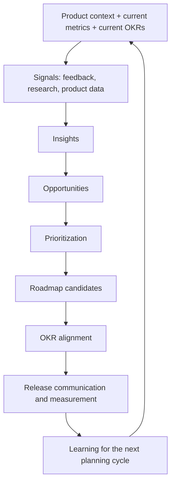

# Product Ops Sandbox

[](https://github.com/AnuragMathurGitHub/product-ops-sandbox-public/actions/workflows/tests.yml)
[](LICENSE)
[](pyproject.toml)
[](requirements.txt)
[](https://github.com/astral-sh/ruff)

A practical Product Operations sandbox for turning scattered product signals into clearer product decisions.

This repo uses a fictional product, fictional data, simple Python scripts, and AI assisted workflows to show how a modern Product Ops loop can work:



The point is not to build a production platform. The point is to make the workflow easy to understand, run, and adapt.

## What You Can Do With This Repo

| Goal | What To Do |
| --- | --- |
| Understand Product Ops | Read the README, system map, and generated outputs |
| Onboard a first-time user | Follow `START_HERE.md` and `docs/07-customer-onboarding-user-flow.md` |
| Explain the workflow to a team | Walk through the fictional product, metrics, roadmap candidates, OKR alignment, release measurement, and AI workflow |
| Run the sample workflow | Clone or download the repo and run the Python scripts |
| Use an AI assistant | Open the repo in your IDE or agent tool, then ask the assistant to explain, adapt, or run parts of the repo |
| Run it fast with ready-made skills | Use the packaged skills for Claude Code, Cursor, or GitHub Copilot in `agent-skills/` and `.claude/skills/`, so your assistant runs each workflow with almost no typing |
| Adapt it to your own product | Replace the fictional data with approved, anonymized product signals |

## Where Your Inputs Go

The repo separates inputs by type.

| Input Type | Folder | Use It For |
| --- | --- | --- |
| Unstructured product notes | `input-notes/` | Support tickets, sales notes, customer success notes, interview transcripts, meeting summaries |
| Structured data | `sample-data/` | CSV files for product events, feedback records, roadmap items, OKRs, and release candidates |
| Generated results | `outputs/` | Markdown and JSON summaries created by scripts or AI assisted workflows |
| AI instructions | `ai-workflows/` | Prompts, schemas, and examples for qualitative synthesis |
| Reusable agent workflows | `agent-skills/` | Skill packages that AI coding assistants can reuse |

Start with one input at a time. For example, add one anonymized support ticket batch to `input-notes/`, run or ask an assistant to run the matching workflow, then review the output before adding more.

## Choose Your Path

| If You Are... | Start With | You Do Not Need |
| --- | --- | --- |
| A product manager or operator | `START_HERE.md` and `outputs/` | Python knowledge |
| A reader reviewing the workflow | This README and the sample outputs | Local setup |
| A learner | `docs/00-product-ops-system-map.md` | Prior Product Ops experience |
| A first-time team adopter | `docs/07-customer-onboarding-user-flow.md` | API keys |
| A technical reviewer | `scripts/`, `tests/`, and `sample-data/` | AI API access |
| An AI workflow builder | `ai-workflows/` and `agent-skills/` | Real customer data |

## How To Get The Files

You have three options.

| Option | Best For | How |
| --- | --- | --- |
| Read on GitHub | Quick review | Open files directly in the browser |
| Download ZIP | Non technical users | Click `Code` -> `Download ZIP` on GitHub |
| Clone with Git | Technical users | Run `git clone https://github.com/AnuragMathurGitHub/product-ops-sandbox-public.git` |

If you do not know what cloning means, use **Download ZIP**. If you use a coding assistant, you can ask it to clone the repo for you.

If you use an AI coding assistant, you can also ask it:

```text
Clone https://github.com/AnuragMathurGitHub/product-ops-sandbox-public.git, open the README, and guide me through it step by step.
```

Copy paste prompt for an IDE assistant or coding agent:

```text
Clone https://github.com/AnuragMathurGitHub/product-ops-sandbox-public.git.
Open README.md and START_HERE.md.
Explain what this Product Ops Sandbox does, then run the sample workflow and show me the outputs I should review.
Do not use or commit real customer data in this public repo.
```

Use that prompt in tools that can work with files and terminal commands, such as Codex, Cursor,
Claude Code, GitHub Copilot in Visual Studio Code, or another IDE assistant. If your tool cannot
clone repositories, download the ZIP or clone it yourself, open the folder in your IDE, and then ask
the assistant to continue from `START_HERE.md`.

## Use It Without Coding

You can use this repo without writing code.

1. Open the repo on GitHub.
2. Read this README.
3. Open `START_HERE.md`.
4. Open `outputs/` to see finished examples.
5. Open `input-notes/` to see where qualitative notes belong.
6. Open `ai-workflows/prompts/` to see the instructions an assistant can follow.
7. Add fictional, anonymized, or approved notes to your own copy of `input-notes/`.
8. Ask your assistant to read the prompt and notes from the repo, then classify, summarize, or map opportunities.

If your assistant cannot access files directly, copy the relevant prompt and anonymized note content into the chat manually.

Useful prompts to ask your assistant:

```text
Explain this repo to me like I am a Product Operations Manager.
```

```text
Guide me through this repo one step at a time. Stop after each step and ask if I understand.
```

```text
Use the feedback classification prompt to classify these anonymized support notes.
```

```text
Help me adapt this sandbox for my own product. Tell me which files I should change first.
```

## Four Ways To Run It

You do not need an API key. Pick the lane that fits you.

| Lane | What it is | Real AI? | API key? |
| --- | --- | --- | --- |
| Read only | Open the finished files in `outputs/` | No | No |
| Agent | Your AI assistant reads a prompt and your notes and writes the result | Yes | No |
| Mock demo | `python scripts/ai_*.py` copies a prepared example so you can see the output shape | No | No |
| API extension | Run `python scripts/ai_real.py` with your own key (Anthropic, OpenAI, or OpenRouter) | Yes | Yes |

The **Agent** lane is the main one: real synthesis, your own assistant, no key. **Mock** is a
deterministic demo. The repo ships an `AGENTS.md` so coding assistants have one clear workflow map.
For the onboarding journey, persona paths, and tool choice map, see
[docs/07-customer-onboarding-user-flow.md](docs/07-customer-onboarding-user-flow.md).
For the full user flow and per tool invocation, see [docs/03-how-to-run-the-workflows.md](docs/03-how-to-run-the-workflows.md).
For what an API key would mean and where it would be used, see [docs/04-api-extension.md](docs/04-api-extension.md).

## Use It With An AI Assistant

The repo includes entry points so an assistant can run a workflow with almost no typing.

| Mode | How To Use This Repo |
| --- | --- |
| IDE with assistant | Open the folder in Visual Studio Code, JetBrains, or another IDE, then ask the assistant to read `START_HERE.md` |
| AI native IDE | Open the folder in Cursor or a similar tool and ask it to classify the notes in `input-notes/` |
| Terminal agent | Use Codex, Claude Code, Gemini CLI, or another agent that can read files and run commands |
| GitHub Copilot in VS Code | Use `@workspace`, the `.github/prompts/` files, or ask it to follow `AGENTS.md` |
| Claude Code | Run a command like `/classify-feedback`, or use the `/product-ops-signal-triage` skill in `.claude/skills/` |
| Chat only assistant | Paste a prompt from `ai-workflows/prompts/` plus the note content when the tool cannot access files |

Do not paste sensitive customer data, private company notes, or personal information into public AI tools. Use fictional, anonymized, or approved examples.

Good first request:

```text
Read the README and START_HERE.md. Then explain which files I should open first and why.
```

## Run It Locally

If you are comfortable with a terminal:

```bash
git clone https://github.com/AnuragMathurGitHub/product-ops-sandbox-public.git
cd product-ops-sandbox-public
python scripts/analyze_feedback.py
python scripts/score_roadmap.py
python scripts/summarize_metrics.py
python scripts/summarize_okrs.py
python scripts/summarize_releases.py
```

The mock demo scripts copy prepared examples so you can see the output shape with no AI and no API
key. They are a deterministic demo, not the real AI workflow (that is the Agent lane above).

```bash
python scripts/ai_classify_feedback.py
python scripts/ai_synthesize_research.py
python scripts/ai_detect_opportunities.py
python scripts/ai_review_product_planning.py
python scripts/ai_align_okrs.py
python scripts/ai_plan_release_measurement.py
python scripts/ai_weekly_product_insights.py
```

Each writes a `.json` draft and a readable `.md` summary into `outputs/`.

The optional `scripts/ai_real.py` is different: it calls a real model with your own API key, and it
gates every reply through `scripts/harness.py`, so a draft that does not match its schema is retried
and then rejected instead of written. See [docs/04-api-extension.md](docs/04-api-extension.md) for
how to set a key and run it.

The public repo does not require an API key. API keys are only for private automation, such as a
scheduled script or internal service that calls a model directly. See [docs/04-api-extension.md](docs/04-api-extension.md).

## Run The Tests

The tests use the Python standard library only. They cover the scoring formula, event counting, the
feedback summary, empty metrics handling, the mock copy step, the schema gate in
`scripts/harness.py` (parse, validate, retry, fail closed), the repo hygiene scan, that the sample
outputs match their schemas, and that the deterministic scripts reproduce the committed outputs
byte for byte.

```bash
python -m unittest discover -s tests
```

## Development

Contributing uses a small set of dev tools. None of this is needed to run the sandbox.

```bash
pip install -r requirements-dev.txt
pre-commit install
python tasks.py check
```

`tasks.py` holds every development command (`test`, `run`, `demo`, `lint`, `format`, `typecheck`,
`scan`, `check`) with the Python standard library only. CI runs the same gates on every pull
request, across Python 3.10 to 3.13, plus a determinism job that reruns every script and fails if
the committed outputs change. See [CONTRIBUTING.md](CONTRIBUTING.md) for the ground rules and
[CHANGELOG.md](CHANGELOG.md) for release history.

## Adapt It To Your Own Product

For a step by step version of this section, see [docs/06-adapt-this-sandbox.md](docs/06-adapt-this-sandbox.md).

Use fictional, synthetic, anonymized, or approved data in public work. In a private company
environment, use real data only if you have permission and the data handling controls are clear.

Start small:

1. Copy the repo.
2. Replace one sample file in `sample-data/`.
3. Keep the same column names at first.
4. Run the matching script or ask your AI assistant to help.
5. Review the generated output.
6. Update the product context, metrics, and taxonomy.
7. Repeat with the next signal source.

Most teams will need to adjust:

| Area | What To Change |
| --- | --- |
| Product context | Users, buyers, internal teams, product problem |
| Metrics | Activation, engagement, retention, support, and business metrics |
| Feedback taxonomy | Product areas, themes, severity, linked metrics |
| Roadmap scoring | Reach, impact, confidence, effort, strategic fit |
| OKR alignment | Objectives, key results, linked metrics, and evidence |
| Release planning | Release candidates, audiences, owners, and measurement windows |
| AI prompts | Product specific language and guardrails |
| Agent skills | Taxonomy, output format, review rules |

Later, teams can extend the same structure with approved API connections or internal data exports. The base repo starts with files because files are easier to inspect, safer to share, and simpler for learning.

## Fictional Product Example

The sandbox uses a fictional product called **FitPass Demo**.

FitPass Demo is a corporate wellness app where employees can:

- activate a wellness membership
- search for gyms and classes
- book classes
- check in at partner gyms
- track wellness activity

The product is fictional. The data is fictional. There is no connection to any real company.

## Product Problem

FitPass Demo is a B2B2C product. Employers are the buyers, but employees are the daily users.

That creates a Product Ops challenge:

```text
The product must create visible value for both groups.
```

For employees, value means:

- finding relevant gyms or classes
- booking with confidence
- checking in successfully
- building a habit that feels worth continuing

For employers, value means:

- employees know the benefit exists
- enough employees activate and use it
- usage supports the employee value proposition
- the account has a clear renewal story

The business problem is not simply "more usage." In some models, unused benefits may reduce short term cost. The longer term risk is different: if employees do not find value, the employer may question adoption, satisfaction, renewal, and whether the benefit is worth keeping.

So this sandbox focuses on one question:

```text
How can Product Ops connect feedback, research, and product data
to understand where employees fail to reach value
and which product improvements should be prioritized?
```

That creates practical Product Ops questions:

| Question | Where The Repo Helps |
| --- | --- |
| Where do users drop off? | Product analytics and metrics |
| What are users and customers saying? | Feedback system and AI classification |
| What explains the behavior? | User research synthesis |
| What should the roadmap consider? | Opportunity mapping and prioritization |
| Which outcomes should improve? | Success metrics and OKR alignment |
| How should teams launch changes? | Release measurement planning |
| How do we learn after release? | Measurement loop |

## What This Repo Demonstrates

| Area | What It Shows |
| --- | --- |
| Product context | Who the users, buyers, partners, and internal teams are |
| Success metrics | What the team should measure and why |
| Product analytics | Which events answer important product questions |
| Customer feedback | How feedback can be tagged, grouped, and linked to metrics |
| User research | How qualitative notes become themes and insights |
| Prioritization | How roadmap candidates can be compared without replacing judgment |
| OKRs | How product work aligns to measurable outcomes |
| Release communication | How teams prepare for launch and learning after release |
| AI assisted workflows | How AI can help synthesize qualitative notes with human review |
| Agent skills | How repeatable AI workflows can be packaged for reuse |

## Two Operating Lanes

This repo separates the work into two lanes.

| Lane | Use For | Why |
| --- | --- | --- |
| Deterministic Python | Metrics, counts, scoring, repeatable summaries | The answer should be calculated |
| AI assisted synthesis | Interviews, support tickets, sales notes, customer success notes | The input is qualitative language |

Simple rule:

```text
Code calculates.
AI drafts.
Humans decide.
```

## How The Planning Loop Works

The later planning steps are connected, but the repo does not decide them by itself.

```text
Signals explain what is happening.
Insights explain why it may matter.
Opportunities define what could improve.
Prioritization compares what deserves attention.
Roadmap candidates show what the team may build.
OKR alignment connects work to measurable outcomes.
Release planning prepares teams for launch.
Measurement checks whether the change worked.
```

OKRs are especially important to frame correctly. Product teams should not create OKRs only from raw feedback. OKRs usually come from strategy, company priorities, and product outcomes. Feedback, research, analytics, and roadmap candidates help test whether the work supports those outcomes.

## What You Should See

The scripts generate readable outputs.

| Output | Purpose |
| --- | --- |
| `feedback_theme_summary.md` | Repeated feedback themes and severity counts |
| `roadmap_priority_scores.md` | Roadmap candidates scored with a transparent formula |
| `metrics_snapshot.md` | Basic product usage metrics |
| `okr_snapshot.md` | Current sample OKRs and linked metrics |
| `release_readiness_snapshot.md` | Release candidates, owners, and measurement windows |
| `ai_feedback_classification.json` | Structured AI assisted feedback classification |
| `ai_research_synthesis.json` | Structured AI assisted research synthesis |
| `ai_opportunity_map.json` | Product opportunities from qualitative signals |
| `ai_product_planning_review.md` | Signal to planning review |
| `ai_okr_alignment.json` | Draft alignment between evidence, roadmap candidates, and OKRs |
| `ai_release_measurement_plan.json` | Draft release communication and measurement plan |
| `ai_weekly_product_insights.md` | Weekly Product Ops summary |

## Why JSON Appears In The AI Examples

Markdown is good for human summaries. JSON is useful when output needs a predictable structure.

Example:

```json
{
  "theme": "Failed check in",
  "severity": "High",
  "linked_metric": "Check In Failed Count"
}
```

JSON makes AI output easier to validate, compare, review, and reuse in another workflow. When a summary is meant for humans, the repo also uses Markdown files.

## Repository Map

The public repo is organized around how a reader learns and uses the system.

```text
product-ops-sandbox-public/
|-- README.md
|-- START_HERE.md
|-- AGENTS.md                 (how any AI agent runs the workflows)
|-- SECURITY.md
|-- LICENSE
|-- CONTRIBUTING.md
|-- CODE_OF_CONDUCT.md
|-- CHANGELOG.md
|-- pyproject.toml              (project metadata + lint and type config)
|-- tasks.py                    (dev commands: test, run, lint, scan, check)
|-- requirements.txt
|-- requirements-ai.txt         (optional, for scripts/ai_real.py only)
|-- requirements-dev.txt        (dev tools: ruff, mypy, pre-commit)
|-- docs/
|   |-- 00-product-ops-system-map.md
|   |-- 01-product-context.md
|   |-- 02-success-metrics.md
|   |-- 03-how-to-run-the-workflows.md
|   |-- 04-api-extension.md
|   |-- 05-planning-loop.md
|   |-- 06-adapt-this-sandbox.md
|   `-- 07-customer-onboarding-user-flow.md
|-- input-notes/
|   |-- README.md
|   |-- support-ticket-batch.md
|   |-- user-interview-transcript.md
|   `-- weekly-product-ops-packet.md
|-- sample-data/
|   |-- customer_feedback.csv
|   |-- product_events.csv
|   |-- roadmap_items.csv
|   |-- okrs.csv
|   `-- releases.csv
|-- scripts/
|   |-- analyze_feedback.py
|   |-- score_roadmap.py
|   |-- summarize_metrics.py
|   |-- summarize_okrs.py
|   |-- summarize_releases.py
|   |-- ai_*.py                 (mock demo scripts, no key needed)
|   |-- ai_real.py              (optional real-AI pipeline, key required)
|   `-- harness.py              (schema gate: validate AI drafts, retry, fail closed)
|-- tests/
|   |-- test_harness.py
|   |-- test_outputs_deterministic.py
|   |-- test_scripts.py
|   `-- test_tasks.py
|-- outputs/
|   |-- README.md
|   |-- feedback_theme_summary.md
|   |-- roadmap_priority_scores.md
|   |-- metrics_snapshot.md
|   |-- okr_snapshot.md
|   |-- release_readiness_snapshot.md
|   `-- ai_* (.json drafts + .md summaries)
|-- ai-workflows/
|   |-- README.md
|   |-- prompts/
|   |-- schemas/
|   `-- sample-outputs/
|-- agent-skills/
|   |-- README.md
|   |-- product-ops-signal-triage/
|   |-- product-ops-research-synthesis/
|   |-- product-ops-opportunity-mapping/
|   |-- product-ops-planning-review/
|   |-- product-ops-okr-alignment/
|   |-- product-ops-release-measurement/
|   `-- product-ops-weekly-review/
|-- .claude/
|   |-- commands/
|   `-- skills/
|-- .cursor/
|   `-- rules/
|-- .github/
|   |-- copilot-instructions.md
|   |-- prompts/
|   |-- ISSUE_TEMPLATE/
|   |-- workflows/              (CI: tests, lint, types, scan, determinism)
|   |-- dependabot.yml
|   `-- pull_request_template.md
|-- .editorconfig
|-- .pre-commit-config.yaml
`-- .gitignore
```

## What This Is Not

This repo is not:

- a real analytics platform
- a replacement for Mixpanel, Productboard, Condens, or any other commercial tool
- connected to a real company
- based on real customer data
- an AI system that makes product decisions on its own

It models the workflows those tool categories often support:

- analytics planning
- feedback management
- research synthesis
- roadmap prioritization
- OKR alignment
- release communication and measurement
- AI assisted synthesis

## License

This project uses the MIT License. That means people can copy, adapt, and reuse the sandbox as long
as they keep the license notice. You still own your own product data, notes, and private adaptations.
Do not publish sensitive data in this repo or any public fork.

## Security And Data Handling

This repo is designed for public learning. The sample files are fictional.

The rule is simple:

```text
Public repo = fictional, synthetic, anonymized, or approved examples.
Private company copy = real data only if you have permission and controls.
```

Do not commit or publish sensitive data, credentials, or confidential business information. If you
adapt the sandbox for real customer notes, keep that work in a private repo or local ignored files,
and review `SECURITY.md` before sharing anything.

## Extending The Sandbox

This repo starts with files so the workflow is easy to understand.

Possible extensions:

- connect approved product analytics exports
- import anonymized support tickets
- add customer success meeting summaries
- connect to internal data through approved APIs
- add dashboards or scheduled weekly summaries
- customize the agent skills for a specific product or company

If you adapt the sandbox and need help deciding what to change first, open an issue or contact the repo creator.
