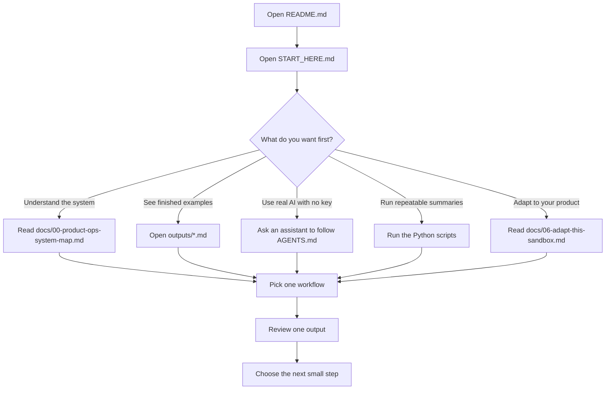

# Start Here

This guide walks you through the Product Ops Sandbox in the order a first time reader should use it.

You do not need to know Python to start. You can read the examples, use an AI assistant, or run the scripts later if you want.

By the end, you should understand how product feedback, user research, product data, prioritization, OKR alignment, release communication, measurement, and AI assisted workflows connect.

## What You Will Learn

You will learn how a Product Ops workflow can move from raw signals to product decisions:

```text
product context
+ current metrics
+ current OKRs
+ signals
-> insights
-> opportunities
-> roadmap candidates
-> OKR alignment
-> release communication and measurement
-> learning for the next planning cycle
```

The repo uses a fictional product called **FitPass Demo** and fictional data. It is safe to inspect, adapt, and discuss publicly.

## Before You Start

Choose the path that matches how you want to use the repo.

| Path | Best For | What You Need |
| --- | --- | --- |
| Read only | PMs, operators, learners, curious readers | GitHub browser |
| AI assisted | Product Ops, PMs, non engineers | An IDE assistant, coding agent, or chat assistant |
| Technical | Analysts, engineers, technical PMs | Python and a terminal |

If you are not sure, start with **Read only**.

If you do not have the files yet, go back to the README and follow **How To Get The Files**.

## First-Time User Flow

Use this map to choose the right first action. The public sandbox is designed so you can learn it
without credentials, then decide whether to read, use an assistant, run scripts, or adapt it.



For the deeper onboarding map, persona paths, and tool choices, see
`docs/07-customer-onboarding-user-flow.md`.

Fastest AI assistant start:

```text
Clone https://github.com/AnuragMathurGitHub/product-ops-sandbox-public.git, open START_HERE.md, and walk me through the repo one step at a time.
```

Use this in a tool that can work with repositories, such as Codex, Claude Code, Cursor, GitHub
Copilot in Visual Studio Code, or another IDE assistant. If your assistant cannot clone the repo,
download the ZIP or clone it yourself, open the folder in your IDE, then ask the assistant to
continue.

## Step 1: Understand The Product

Start with the fictional product.

FitPass Demo is a B2B2C corporate wellness app:

- employers are the buyers
- employees are the daily users
- gyms and wellness providers are partners
- product, support, sales, customer success, marketing, and operations all see different signals

The important business question is not simply:

```text
How do we get more usage?
```

The better question is:

```text
How do we help employees reach enough value that employers can see the benefit is worth keeping?
```

## Step 2: Understand The Operating Loop

Product Ops connects signals that often live in separate places.

```text
customer feedback
+ user research
+ product analytics
-> themes and insights
-> product opportunities
-> prioritization
-> roadmap candidates
-> OKR alignment
-> release communication and measurement
-> learning for the next planning cycle
```

This is the core idea of the repo.

## Step 3: Know Where Inputs Go

The repo separates inputs by type.

| Input Type | Where It Goes | Example Files |
| --- | --- | --- |
| Unstructured product notes | `input-notes/` | Support notes, sales notes, customer success notes, interview transcripts |
| Structured data | `sample-data/` | CSV files for events, feedback records, roadmap items, OKRs, release candidates |
| AI workflow instructions | `ai-workflows/` | Prompts, schemas, and sample AI outputs |

Use this rule:

```text
Notes and transcripts go in input-notes/.
Spreadsheet style data goes in sample-data/.
Generated results go in outputs/.
```

### What Counts As An Input Note?

An input note is any qualitative product signal written in human language.

Examples:

- support ticket batch
- sales call notes
- customer success meeting notes
- user interview transcript
- partner feedback
- app review excerpts

For the public repo, use fictional, anonymized, or approved notes only. For private company work,
use real notes only with the right permission and do not commit sensitive files back to a public repo.

## Step 4: Look At The Outputs

Open `outputs/`.

The outputs show what the workflow produces.

| Output | What It Helps Answer | Easy To Read? |
| --- | --- | --- |
| `metrics_snapshot.md` | What is happening in the product? | Yes |
| `feedback_theme_summary.md` | What feedback themes repeat? | Yes |
| `roadmap_priority_scores.md` | Which roadmap items look strongest? | Yes |
| `okr_snapshot.md` | Which outcomes and key results are in the sample plan? | Yes |
| `release_readiness_snapshot.md` | Which releases need communication and measurement planning? | Yes |
| `ai_feedback_classification.json` | How can qualitative feedback become structured themes? | JSON draft + `.md` summary |
| `ai_research_synthesis.json` | What did the research reveal? | JSON draft + `.md` summary |
| `ai_opportunity_map.json` | Which product opportunities emerge from the signals? | JSON draft + `.md` summary |
| `ai_product_planning_review.md` | How do signals connect to planning decisions? | Yes |
| `ai_okr_alignment.json` | Which OKRs may the roadmap candidates support? | JSON draft + `.md` summary |
| `ai_release_measurement_plan.json` | How should release communication and measurement work? | JSON draft + `.md` summary |
| `ai_weekly_product_insights.md` | What would a weekly Product Ops readout look like? | Yes |

### You get both JSON and a readable Markdown summary

You do not have to read raw JSON. Most structured AI workflows write **two** files: a structured JSON
draft and a plain English Markdown summary next to it (for example,
`ai_feedback_classification.json` and `ai_feedback_classification.md`). The weekly readout and
product planning review are Markdown only because they are meant for people to read directly.

```text
JSON = the structured draft (fields like theme, severity, linked_metric) for review and reuse.
Markdown = the easy-to-read summary you can scan or paste into a team update.
```

Open the `.md` file if you just want to read the result. Open the `.json` file if an assistant,
script, or reviewer needs consistent fields to compare across notes.

## Step 5: Try One AI Assisted Workflow

**Get the files first.** This workflow reads files from the repo, so you need a local copy. If you
have not done this yet, go back to the README and follow **How To Get The Files** (Download ZIP or
`git clone`). You do not need an API key for this step.

### Why use this repo instead of just pasting into ChatGPT?

You could paste one note into a chat and ask for a summary. The repo adds value when you do more
than that:

- **Batch many notes together.** Drop support tickets, sales notes, and interviews into
  `input-notes/` and process them with the same workflow instead of one separate chat at a time.
- **Reuse the same prompt and taxonomy.** Everyone classifies into the same product areas, themes,
  and severities, so results are comparable week to week.
- **Get structured output.** The prompt asks for JSON that matches a schema, so the result can be
  reviewed, compared, and reused, not just read once and lost in a chat.
- **Keep reviewable drafts.** Outputs land in `outputs/` so a human can check them before any
  decision.

### Two lanes: code and AI

This repo has two lanes, and this step is the AI lane:

- **Deterministic scripts** (Step 6) handle anything that should be calculated the same way every
  time, such as counts, scores, and metric snapshots.
- **AI assisted synthesis** (this step) handles qualitative language, such as notes, tickets, and
  interviews.

We start with the AI lane because it is the headline. The deterministic scripts come next in Step 6.

### The workflow is folder based

```text
input-notes/            (your notes)
-> ai-workflows/prompts/ (the instructions for the assistant)
-> outputs/              (the draft result you review)
```

### Which prompt do I use?

Pick the prompt that matches what you have. Each prompt already knows to read from `input-notes/`.

| You Have | Use This Prompt | You Get |
| --- | --- | --- |
| Support / sales / success notes | `ai-workflows/prompts/classify_feedback.md` | `outputs/ai_feedback_classification.json` (+ `.md` summary) |
| An interview or research transcript | `ai-workflows/prompts/synthesize_research.md` | `outputs/ai_research_synthesis.json` (+ `.md` summary) |
| A mix of signals to turn into ideas | `ai-workflows/prompts/detect_opportunities.md` | `outputs/ai_opportunity_map.json` (+ `.md` summary) |
| Planning outputs to review | `ai-workflows/prompts/review_product_planning.md` | `outputs/ai_product_planning_review.md` |
| Current OKRs plus roadmap candidates | `ai-workflows/prompts/align_okrs.md` | `outputs/ai_okr_alignment.json` (+ `.md` summary) |
| Release candidates plus metrics | `ai-workflows/prompts/plan_release_measurement.md` | `outputs/ai_release_measurement_plan.json` (+ `.md` summary) |
| Metrics plus themes for a readout | `ai-workflows/prompts/weekly_product_insights.md` | `outputs/ai_weekly_product_insights.md` |

### Three ways to run a workflow

| Way | What you do | Real AI? | API key? |
| --- | --- | --- | --- |
| Agent, guided | Open the repo in an IDE assistant, AI native IDE, or terminal agent, then ask in plain language. `AGENTS.md` gives the assistant the workflow map. | Yes | No |
| Agent, manual | Tell your assistant which prompt and notes to read (see the example below). | Yes | No |
| Mock demo | Run the Python script in Step 7. It copies a prepared example so you can see the output shape with no AI and no key. | No | No |

The two agent ways are the real workflow: your own assistant does the synthesis, with no API key.
Mock is a deterministic demo of what the output looks like.

There is also an API extension path for teams that want private automation later. You do not need it
for this walkthrough. If you want a hands-off, one-command run with your own API key, the repo ships
an optional `scripts/ai_real.py` pipeline that works with Anthropic, OpenAI, or OpenRouter. Read
`docs/04-api-extension.md` for how to set a key, choose a provider, choose a current model, and run
it. The public repo still works with no key at all.

### Try the simplest one (feedback classification)

1. Open the sample note file: `input-notes/support-ticket-batch.md`.
2. Open the matching prompt: `ai-workflows/prompts/classify_feedback.md`.
3. Ask your assistant to read both files from the repo.
4. Ask it to write the result into `outputs/` (or show it in chat).
5. Review the result before using it for decisions.

To use your own notes later, add a new `.md` file inside `input-notes/`. In this public repo, keep
the content fictional, anonymized, or approved. If you are using sensitive real notes in a private
environment, name local files with `private-` or `local-` so `.gitignore` helps prevent accidental commits.

Example request for an IDE assistant or coding agent:

```text
Read ai-workflows/prompts/classify_feedback.md and the notes in input-notes/.
Classify the notes into product area, theme, severity, linked metric, evidence summary, and possible opportunity.
Write the JSON draft to outputs/ai_feedback_classification.json and a short readable summary to outputs/ai_feedback_classification.md.
Do not invent facts.
```

If you are using a chat only assistant that cannot access files, copy the prompt and the anonymized
note content into the chat manually. That is the fallback, not the main path.

## Step 6: Run The Scripts

This step is optional, but it shows the deterministic workflow.

| Script | Input | Output | Why Run It |
| --- | --- | --- | --- |
| `scripts/analyze_feedback.py` | `sample-data/customer_feedback.csv` | `outputs/feedback_theme_summary.md` | See repeated feedback themes and severity counts |
| `scripts/score_roadmap.py` | `sample-data/roadmap_items.csv` | `outputs/roadmap_priority_scores.md` | Compare roadmap candidates with a transparent formula |
| `scripts/summarize_metrics.py` | `sample-data/product_events.csv` | `outputs/metrics_snapshot.md` | Create a basic product metrics snapshot |
| `scripts/summarize_okrs.py` | `sample-data/okrs.csv` | `outputs/okr_snapshot.md` | Show current objectives, key results, metrics, and status |
| `scripts/summarize_releases.py` | `sample-data/releases.csv` | `outputs/release_readiness_snapshot.md` | Show release candidates, owners, and measurement windows |

Run:

```bash
python scripts/analyze_feedback.py
python scripts/score_roadmap.py
python scripts/summarize_metrics.py
python scripts/summarize_okrs.py
python scripts/summarize_releases.py
```

These scripts are deterministic. If the input files do not change, the outputs should not change.

To confirm the scripts still behave after you change them, run the tests:

```bash
python -m unittest discover -s tests
```

## Step 7: See A Mock Demo (Optional, No AI Needed)

The mock scripts do not call an AI model. They copy prepared example outputs into `outputs/` so you
can see the shape of each result with no AI and no API key.

This is a demo, not the real workflow. The real workflow is Step 5: your own assistant reads the
prompt and your notes and writes the output. Use mock when you just want to see what good output
looks like, or when you do not have an assistant handy.

| Script | Input Idea | Output | Why It Exists |
| --- | --- | --- | --- |
| `scripts/ai_classify_feedback.py` | Notes from `input-notes/` | `ai_feedback_classification.json` + `.md` | Shows how qualitative notes can become structured feedback themes |
| `scripts/ai_synthesize_research.py` | Interview notes | `ai_research_synthesis.json` + `.md` | Shows how research can become themes, insights, and implications |
| `scripts/ai_detect_opportunities.py` | Combined signals | `ai_opportunity_map.json` + `.md` | Shows how signals can become opportunity statements |
| `scripts/ai_review_product_planning.py` | Generated planning outputs | `ai_product_planning_review.md` | Shows how evidence connects to planning decisions |
| `scripts/ai_align_okrs.py` | OKRs plus planning outputs | `ai_okr_alignment.json` + `.md` | Shows how roadmap candidates may support outcomes |
| `scripts/ai_plan_release_measurement.py` | Release candidates plus metrics | `ai_release_measurement_plan.json` + `.md` | Shows launch communication and measurement planning |
| `scripts/ai_generate_weekly_summary.py` | Metrics plus themes | `ai_weekly_product_insights.md` | Shows a weekly Product Ops readout |

Each script writes its result into `outputs/`. The first three write both a structured JSON draft
and a matching `.md` summary so you can read the result without opening JSON.

Run:

```bash
python scripts/ai_classify_feedback.py
python scripts/ai_synthesize_research.py
python scripts/ai_detect_opportunities.py
python scripts/ai_review_product_planning.py
python scripts/ai_align_okrs.py
python scripts/ai_plan_release_measurement.py
python scripts/ai_generate_weekly_summary.py
```

Why "mock"? These scripts do not call a live AI model. They copy prepared example results into
`outputs/` so the workflow runs the same way for everyone, with no API key and no risk of sending
data anywhere. Live AI mode can be added later with approved data, credentials, and model access.
Mock mode is the safe default.

## Step 8: Adapt It To Your Product

Start small.

Do not replace everything at once.

Recommended order:

| Step | What To Change | Where |
| --- | --- | --- |
| 1 | Product context | `docs/01-product-context.md` |
| 2 | Success metrics | `docs/02-success-metrics.md` |
| 3 | One structured CSV | `sample-data/` |
| 4 | One anonymized note file | `input-notes/` |
| 5 | One AI prompt | `ai-workflows/prompts/` |
| 6 | One output review | `outputs/` |
| 7 | OKR, release, or roadmap assumptions | `sample-data/`, `docs/`, and `agent-skills/` |

### Your First Change, Step By Step

Do not edit everything. Make one safe change and watch it flow through:

1. **Add one note file.** Create a new file in `input-notes/`, for example
   `input-notes/my-support-notes.md`. Paste 5 to 10 short, fictional or anonymized notes, one per line
   or as short bullets. Keep it the same shape as `input-notes/support-ticket-batch.md`.
2. **Run the workflow on it.** Ask your assistant: *"Read `ai-workflows/prompts/classify_feedback.md`
   and `input-notes/my-support-notes.md`, classify the notes, and write the draft to
   `outputs/ai_feedback_classification.json`."*
3. **Open the result.** Read `outputs/ai_feedback_classification.md` (the readable summary). Check
   that the themes and severities match what your notes actually say.
4. **Then adjust the edges.** Once that works, change the product story in
   `docs/01-product-context.md`, the metrics in `docs/02-success-metrics.md`, or a CSV in
   `sample-data/`. When editing a CSV, **keep the existing column headers the same at first** so the
   scripts still run; change only the rows. Run the matching script again and review the new output.

The rule: change one input, run or ask again, review the output, then decide the next change.

## Useful Assistant Requests

You can ask your assistant:

```text
Explain the Product Ops Sandbox to me in simple terms.
```

```text
Walk me through this repo one step at a time. Stop after each step and ask if I understand.
```

```text
Look at input-notes/ and tell me which workflow should process each note file.
```

```text
Run the deterministic scripts, explain what each output means, and tell me what product decisions they support.
```

```text
Help me adapt this sandbox for my product. Ask me the minimum questions needed before changing files.
```

## What To Read Next

| If You Want To... | Open |
| --- | --- |
| Understand the customer onboarding flow | `docs/07-customer-onboarding-user-flow.md` |
| Understand the full system | `docs/00-product-ops-system-map.md` |
| Understand how a workflow runs end to end | `docs/03-how-to-run-the-workflows.md` |
| Understand planning, OKRs, release, and measurement | `docs/05-planning-loop.md` |
| Adapt the sandbox to your own product | `docs/06-adapt-this-sandbox.md` |
| Understand the optional API key path | `docs/04-api-extension.md` |
| Understand the fictional product | `docs/01-product-context.md` |
| Understand metrics | `docs/02-success-metrics.md` |
| Understand qualitative inputs | `input-notes/README.md` |
| Understand AI assisted workflows | `ai-workflows/README.md` |
| Reuse workflows with an agent | `agent-skills/README.md` |
| Check data and AI safety | `SECURITY.md` |

## Simple Mental Model

Keep this in mind:

```text
Structured data goes through scripts.
Qualitative notes go through AI assisted synthesis.
Humans review the output.
Teams decide what to do.
```

## Planning Mental Model

Use this model when the repo reaches OKRs, release communication, and measurement:

```text
Signals explain what is happening.
Insights explain why it may matter.
Opportunities define what could improve.
Prioritization compares what deserves attention.
Roadmap candidates show what the team may build.
OKR alignment connects work to measurable outcomes.
Release planning prepares teams for launch.
Measurement checks whether the change worked.
```

OKRs should not be created only from feedback. They usually come from strategy, company priorities, and product outcomes. This repo shows how product signals can support, challenge, or refine OKR alignment.
