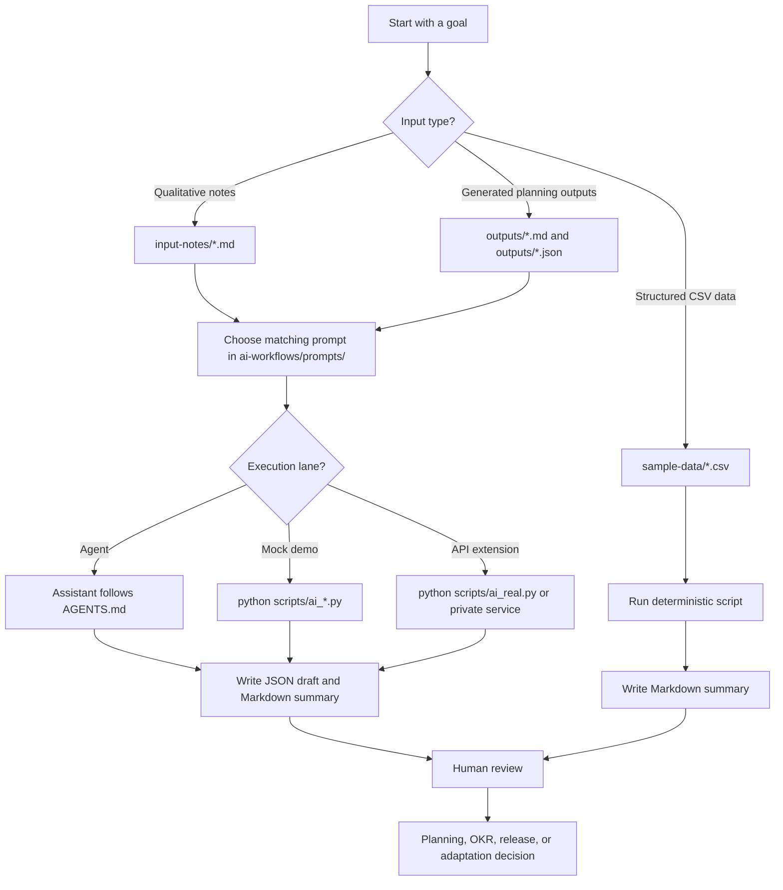

# How The Workflows Run (User Flow)

This is the map of how you go from raw notes to a reviewed product decision, and how to run the AI
part without writing everything by hand.

For the customer-facing onboarding journey, persona routing, and tool choice map, start with
`docs/07-customer-onboarding-user-flow.md`. This doc focuses on how the workflows execute.

## The whole system in one line

```text
INPUTS                 INSTRUCTIONS              EXECUTION LANE            OUTPUTS              HUMAN
input-notes/*.md   ->  ai-workflows/prompts/ ->  pick a lane (below)  ->  outputs/*.json   ->  review
sample-data/*.csv      ai-workflows/schemas/     + AGENTS.md / skills     outputs/*.md         + decide
```

The prompt and its schema are the single source of truth. Every tool entry point (`AGENTS.md`,
`.claude/`, `.cursor/`, `.github/`) is just a thin way to invoke that same prompt.

## Visual User Flow



## The four lanes

| Lane | What it is | Real AI? | API key? | Use it when |
| --- | --- | --- | --- | --- |
| Read only | Open the finished files in `outputs/` | No | No | You want to see results and understand the shape |
| Agent | Your assistant reads the prompt + notes and writes the output | Yes | No | You have an AI assistant and want real synthesis on your own notes |
| Mock demo | `python scripts/ai_*.py` copies a prepared example | No | No | You want a deterministic example run, are offline, or have no assistant |
| API extension | A private script or service calls a model in your own environment | Yes | Yes | A team wants to automate at scale with approved data |

```text
Mock = a deterministic demo of what the output looks like (no AI).
Agent = actually do it with your assistant (real AI, no key).   <- the main lane
API  = automate it at scale in a private environment (real AI, key).
```

If the API row feels confusing, skip it. This public repo works without an API key. The API path is
for teams that later want scheduled or backend automation. See `docs/04-api-extension.md`.

## The Agent lane, made turnkey

The repo ships an `AGENTS.md` workflow map plus tool specific entry points so an assistant has clear
instructions. You usually do not need to paste long prompts manually.

Copy paste start:

```text
Clone https://github.com/AnuragMathurGitHub/product-ops-sandbox-public.git.
Open README.md and START_HERE.md.
Explain the workflow, then classify the sample feedback in input-notes/support-ticket-batch.md.
Then show how the outputs connect to planning review, OKR alignment, and release measurement.
Do not invent facts.
```

| Tool | Turnkey way to run a workflow | Mechanism |
| --- | --- | --- |
| IDE assistant | Open the folder in Visual Studio Code, JetBrains, or another IDE and ask the assistant to read `START_HERE.md` | IDE workspace context |
| AI native IDE | Open the folder in Cursor or a similar tool, then ask for the workflow you want | `AGENTS.md` plus workspace files |
| Terminal agent | Ask Codex, Claude Code, Gemini CLI, or another terminal agent to clone or open the repo | `AGENTS.md` workflow guidance |
| GitHub Copilot in VS Code | Use a `/prompt` from `.github/prompts/`, or ask with `@workspace` | `.github/` plus `AGENTS.md` |
| Claude Code | `/classify-feedback`, or the `/product-ops-signal-triage` skill | `.claude/commands/` + `.claude/skills/` |
| ChatGPT or Claude chat | paste a prompt + notes (fallback) | no file access |

Every workflow writes a structured `.json` draft and a readable `.md` summary, except the weekly
readout and product planning review, which are Markdown only.

## Recommended Run Order

Run the deterministic summaries first:

```bash
python scripts/analyze_feedback.py
python scripts/score_roadmap.py
python scripts/summarize_metrics.py
python scripts/summarize_okrs.py
python scripts/summarize_releases.py
```

Then run the mock AI outputs:

```bash
python scripts/ai_classify_feedback.py
python scripts/ai_synthesize_research.py
python scripts/ai_detect_opportunities.py
python scripts/ai_review_product_planning.py
python scripts/ai_align_okrs.py
python scripts/ai_plan_release_measurement.py
python scripts/ai_generate_weekly_summary.py
```

In the real Agent lane, ask your assistant to follow the prompts in the same order.

## End to End Journeys

- **Product manager or operator (no code):** read the README and `START_HERE.md`, open `outputs/`
  to see finished examples (Read only), then open the repo in your assistant and say "walk me through
  this and classify the sample notes" (Agent). Read the `.md` summary, then review the planning,
  OKR, release, and measurement drafts before any decision.
- **Technical reviewer:** clone the repo, run `python scripts/*.py` (mock demo) to see
  deterministic outputs, run the tests, then inspect the prompts and schemas. Wire the API lane in
  your own environment if you need to automate.
- **Team adopting it:** replace `input-notes/` and `sample-data/` with approved, anonymized data,
  adjust the product context and a skill's taxonomy, run the Agent lane on your notes, and later
  automate with the API lane.

## The principle

```text
Code calculates. AI drafts. Humans review. Teams decide.
```
