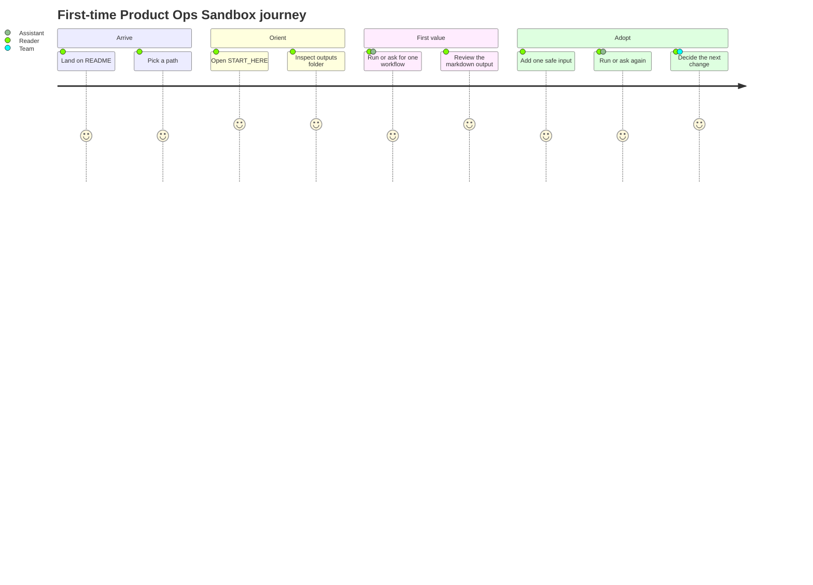
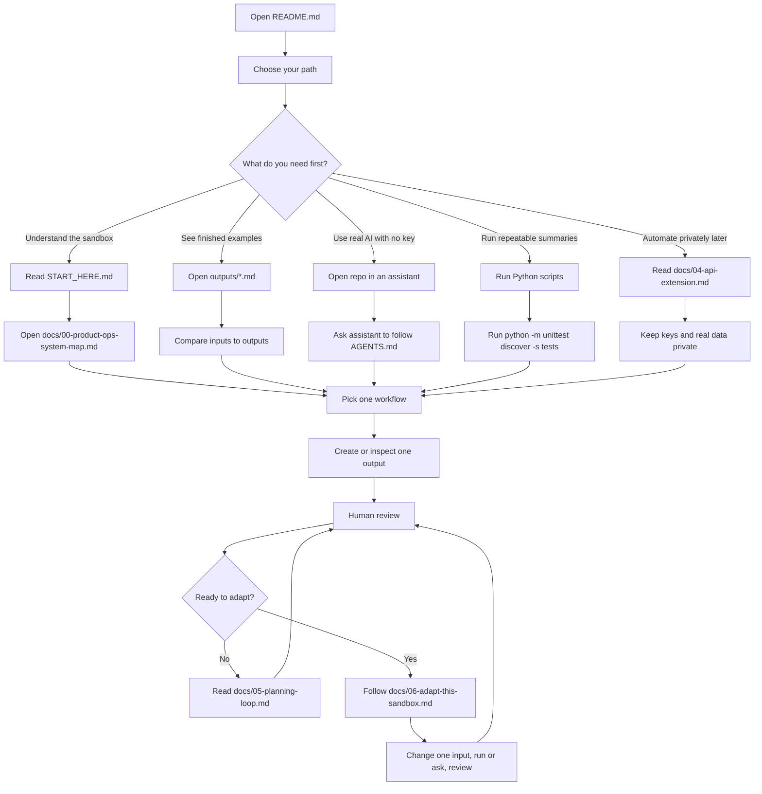
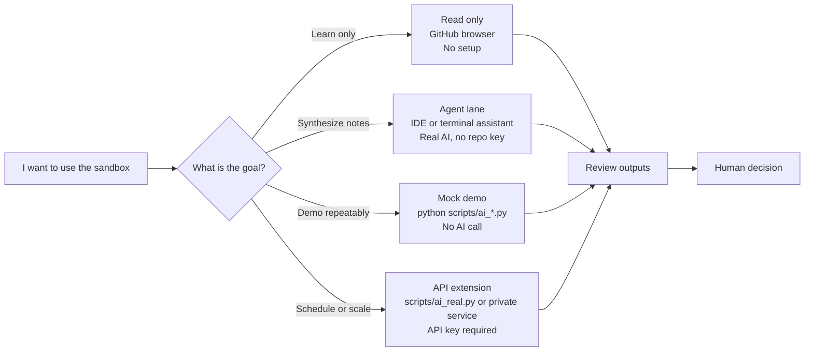
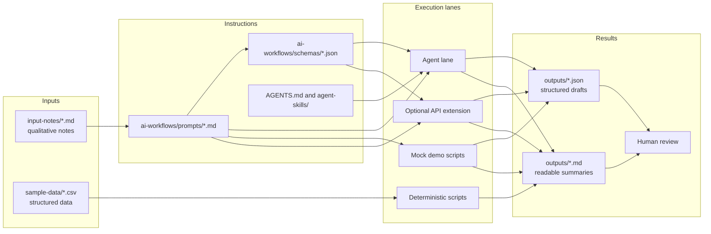
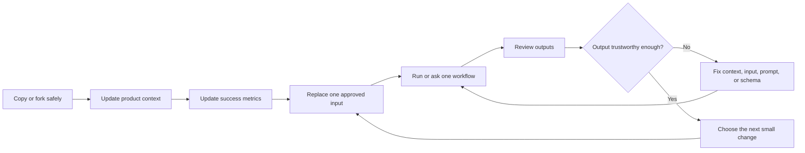

# Customer Onboarding User Flow

This guide is the customer-facing map for the public Product Ops Sandbox. Use it when you are
explaining the repo to a first-time visitor, improving the docs, or helping a team decide how to
adopt the sandbox.

The goal is simple: a new user should reach first value quickly, understand which tool lane fits
their situation, and know the next safe step.

## First Value

A first-time user reaches first value when they can say:

```text
I understand how product signals become reviewed planning outputs,
I know which files to open first,
and I know which lane to use for my next action.
```

For most users, the fastest first value is:

1. Open `START_HERE.md`.
2. Open one readable output in `outputs/`.
3. Ask an assistant to run one workflow, or run one deterministic script.
4. Review the output before making any product decision.

## Who The Onboarding Serves

| Visitor | What They Need First | First Success |
| --- | --- | --- |
| Product manager or Product Ops operator | Understand the loop and where inputs go | Can explain the workflow and open the right output |
| AI assistant user | Know what to ask the assistant to do | Assistant reads a prompt plus notes and writes a reviewed draft |
| Technical reviewer | Verify scripts, schemas, and safety boundaries | Runs scripts and tests without needing an API key |
| Team adopter | Safely adapt the sandbox to their product | Replaces one approved input and reviews the changed output |

## First-Time User Journey



## Full Onboarding Flow



## Lane Chooser

The repo has four lanes. Do not start with the API lane unless you already know you need private
automation.



| Lane | Tooling | Best First Use | Avoid When |
| --- | --- | --- | --- |
| Read only | GitHub browser | A PM or stakeholder wants to understand the workflow | You need changed outputs |
| Agent | Codex, Cursor, Claude Code, GitHub Copilot, Gemini CLI, or another assistant | You want real synthesis on notes with no repo API key | Your tool cannot read files and you cannot paste safe notes |
| Mock demo | Python standard library | You want deterministic sample outputs or an offline demo | You need fresh AI synthesis |
| API extension | Provider SDK plus private key | You need scheduled or backend automation with approved data | You are still learning the sandbox |

## Workflow Stack



## Recommended First Sessions

| Time | User | Path |
| --- | --- | --- |
| 5 minutes | Curious reader | Read README, then open `outputs/ai_weekly_product_insights.md` |
| 15 minutes | PM or Product Ops operator | Read `START_HERE.md`, inspect `input-notes/support-ticket-batch.md`, then open `outputs/ai_feedback_classification.md` |
| 20 minutes | Assistant user | Ask the assistant to read `AGENTS.md`, `ai-workflows/prompts/classify_feedback.md`, and `input-notes/support-ticket-batch.md`, then write the classification draft |
| 20 minutes | Technical reviewer | Run the deterministic scripts and `python -m unittest discover -s tests` |
| 45 minutes | Team adopter | Follow `docs/06-adapt-this-sandbox.md`, change one safe input, run or ask again, and review the changed output |

## Tool Map

| Need | Use This | Why |
| --- | --- | --- |
| Browse without setup | GitHub browser | The README, diagrams, and sample outputs render in place |
| Get a local copy | Download ZIP or `git clone` | Assistant and script workflows need file access |
| Real AI synthesis | IDE assistant, AI native IDE, or terminal agent | The assistant can read prompts, notes, and schemas from the repo |
| Repeatable calculations | Python scripts in `scripts/` | Counts, scores, and summaries should be deterministic |
| Reusable assistant behavior | `AGENTS.md`, `.github/prompts/`, `.claude/`, `.cursor/`, `agent-skills/` | Tool-specific entries point back to the same workflow contract |
| Private automation | `docs/04-api-extension.md` and `scripts/ai_real.py` | API keys and real data must stay out of the public repo |

## Best First Assistant Request

Use this in an assistant that can read files and run commands:

```text
Read README.md, START_HERE.md, and AGENTS.md.
Explain the Product Ops Sandbox in plain language.
Then run or draft the feedback classification workflow using
ai-workflows/prompts/classify_feedback.md and input-notes/support-ticket-batch.md.
Write the result to outputs/ai_feedback_classification.json and a readable summary to
outputs/ai_feedback_classification.md.
Use only evidence in the repo and do not invent facts.
```

If the assistant cannot access files, paste the prompt and safe note content manually. That is the
fallback path, not the main path.

## Adaptation Flow

The safest adoption pattern is one change at a time.



Use this rule:

```text
Change one input. Run or ask. Review the output. Then change the next thing.
```

## Review Gates

Before a new user or team treats the sandbox as useful, confirm:

| Gate | Check |
| --- | --- |
| Safety | Public work uses fictional, synthetic, anonymized, or approved data only |
| Orientation | The user can identify `input-notes/`, `sample-data/`, `ai-workflows/`, and `outputs/` |
| Lane choice | The user knows whether they are reading, using an assistant, running mock demos, or using an API |
| First output | The user has opened or produced at least one readable Markdown output |
| Human review | The user understands that AI output is a draft, not a product decision |
| Next action | The user can name the next file they would change or inspect |

## What Not To Do First

- Do not start by connecting real customer systems to the public repo.
- Do not put API keys, private notes, or confidential data in committed files.
- Do not edit every CSV, prompt, and schema at once.
- Do not treat the mock demo scripts as live AI.
- Do not treat AI-generated JSON as an approved roadmap decision.

## Documentation Design Notes

This guide uses a few documentation choices intentionally:

| Choice | Reason |
| --- | --- |
| Mermaid diagrams | GitHub renders Mermaid in Markdown, and Mermaid supports flowcharts and user journey diagrams |
| Persona paths | Users arrive with different goals, so the first step should route them before giving commands |
| First value focus | New users should see a meaningful result before learning every folder |
| Diataxis-style separation | `START_HERE.md` is the guided tutorial, `docs/03-how-to-run-the-workflows.md` and `docs/06-adapt-this-sandbox.md` are how-to guides, and `docs/01-product-context.md`, `docs/02-success-metrics.md`, `docs/04-api-extension.md`, and `AGENTS.md` act more like explanation or reference |

References:

- GitHub Mermaid rendering: https://docs.github.com/en/get-started/writing-on-github/working-with-advanced-formatting/creating-diagrams
- Mermaid flowcharts: https://mermaid.ai/open-source/syntax/flowchart.html
- Mermaid user journey diagrams: https://mermaid.ai/open-source/syntax/userJourney.html
- Diataxis documentation framework: https://diataxis.fr/

